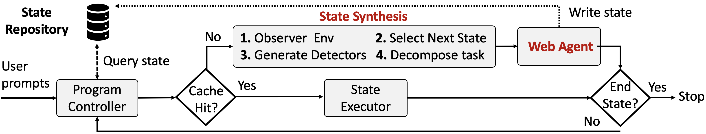
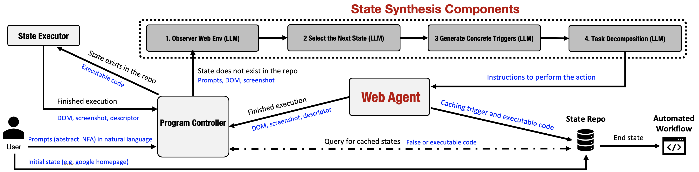

# NetGent Workflow:

## Abstractions

NetGent separates _what_ a workflow should do from _how_ it is executed through three abstractions.

### Abstract NFA

Users define an abstract nondeterministic finite automaton (NFA) using natural-language state prompts.  
Each state prompt specifies _triggers_ (conditions that identify the state), _actions_ (intended task), and an optional _end condition_. This representation captures non-linear flows (complexity) while keeping intent decoupled from UI specifics (robustness).  
For example, in a Disney+/ESPN workflow, states may include `login`, `select_profile`, `navigate_to_espn`, `select_video`, and `playback`.

### Concrete NFA

During execution, NetGent compiles each abstract state into a _concrete state_ defined by \(\hat{s}=(\textit{detectors},\textit{code})\): a set of CSS element, text, or URL detectors bound to the current application version, together with reusable executable code. This compiled form enables deterministic replay (repeatability) and cross-run reuse (efficiency).  
For example, the abstract trigger "if on login page" becomes a detector set (form labels, button text, stable DOM paths) and a short program that types credentials and clicks "Log In."

### Cache and Replay

Concrete states are stored in a _State Repository_; a _State Executor_ replays their code deterministically. If a detector later fails due to UI drift, only that state is regenerated from the abstract rule (robustness). Common states (e.g., `login`, `select_profile`) are reusable across workflows and apps (efficiency, diversity).

## Workflow Execution Model

Figure below illustrates the runtime loop which generates executable code from user prompts.

### Controller queries the cache first

Given the current page (DOM) and the last transition, the _Program Controller_ queries the _State Repository_.  
If a cache hit occurs, the Controller invokes the _State Executor_ to replay the stored code in the browser and the workflow advances.  
This cache-first policy is the core of compile–then–replay and eliminates repeated reasoning (repeatability, efficiency).

### Cache miss triggers one-shot synthesis

On a cache miss, the Controller invokes _State Synthesis_ (LLM), which performs four steps using the current DOM, screenshot, and user's rules:

1. _Observe_ the environment to form a structured view;
2. _Select_ the appropriate next abstract state (trigger–action pair);
3. _Generate_ concrete detectors that reliably recognize that state;
4. _Decompose_ the action into a simplified plan with decomposed tasks.

The decomposed tasks are then executed by the _Web Agent_ which also generates the executable code. Then, the _Concrete State_ is written back to the repository. Only the missing node is synthesized; the abstract NFA and prior states remain intact (robustness, efficiency).

### Realistic execution and termination

To enhance realism and evade bot detection, our web agent integrates browser stealth, human-like interaction, and network control (details in Appendix).  
An end state is declared when an application-level condition holds (e.g., for ESPN, a `<video>` element is playing and time is advancing). Otherwise, the Controller loops to the next state.

### Concrete example

Starting at the Disney+ homepage, the Controller hits cached `login` and `select_profile` states on subsequent runs; on the first run these are synthesized once. Navigating to the ESPN hub and clicking the first video may trigger ads or a PIN prompt; the NFA branches handle these cases by synthesizing (once) a `type_pin` or `skip_ad` state and writing them to the repository. Playback detection serves as the end state, after which NetGent records the successful trace and terminates.

# NetGent Architecture

The system takes high-level user intents expressed as an NFA, where each prompt defines an abstract trigger (the current state of the webpage) and the corresponding task to be executed at that state. For example, a user may specify: if the page is a login screen, enter these credentials and log in.

Starting from a predefined initial state (Google homepage), the program controller advances through prompts by matching the current webpage to the relevant trigger. If a matching state is cached, it executes the stored actions and proceeds. Otherwise, the state synthesis component first generates concrete triggers for the state and then provides step-by-step instructions for the web agent. The web agent executes these instructions and caches the resulting concrete triggers along with their PyAutoGUI and Selenium code for future reuse.

The overview illustrates how NetGent interprets high-level intents and executes workflows reliably. We now detail the core system components that implement this functionality and enable scalable, repeatable automation.

## System Components

NetGent is built around five core components. We describe each component in turn, highlighting its inputs, internal operations, and outputs to illustrate how they collectively enable scalable, repeatable, and robust workflow automation.

### Program Controller

The Program Controller receives user prompts in natural language (an abstract NFA) and uses them to drive execution from the initial state to the end state. Whenever the action for the current state is performed (e.g., logging in), the controller receives the resulting Document Object Model (DOM), a screenshot, and a descriptor for the new state. It then deterministically evaluates concrete triggers in the DOM against the state repository using a simple coded workflow (no LLMs or agents). If a matching state is found, the controller retrieves the corresponding executable code and passes it to the State Executor to perform the actions. If no match is found, the controller forwards the user prompts, DOM, screenshot, and descriptor to the State Synthesis Component for further processing and generation of executable code.

### State Repository

The State Repository receives the initial state defined by the user, along with any new states generated during execution by the web agent. It stores these states in the form of concrete **trigger–action** pairs. Its primary role is to maintain a cache of states, enabling the system to efficiently reuse executable code for recurring scenarios instead of regenerating it each time. When the system reaches an _end state_, the repository serves as the final output, providing a structured record of all relevant states (a concrete NFA) that were utilized or created during the process.

### State Executor

The State Executor receives executable code from the Program Controller, executes it in the browser, and then forwards the resulting DOM, screenshot, and state descriptor back to the Program Controller.

### State Synthesis Components

Component ① serves as the entry point of State Synthesis and receives its inputs—pre-processed DOM, a screenshot of the current browser, and the list of user-defined prompts—from the Program Executor. Using these inputs, the LLM interprets both the DOM structure and the visual context of the screenshot to produce a structured observation of the browser environment. This observation forms the basis for the following components.

Component ② uses the observation from Component ① along with the user-defined prompts to identify the appropriate next state. Leveraging the LLM’s ability to understand context, it selects the most suitable **abstract trigger–action** pair that represents the next step in the workflow. The selected state is then passed forward for refinement into a concrete trigger–action representation.

Component ③ refines the selected state by combining the environment observation from Component ① with the abstract state produced in Component ②. The LLM converts the high-level user-defined trigger into a precise, concrete trigger bound to the chosen state. This concrete trigger ensures that the state can be cached and reliably re-executed by the State Executor.

Component ④ processes the user-defined action associated with the state selected in Component ②. Using an LLM, it translates the high-level action into a structured, step-by-step execution plan for the Web Agent. This plan specifies ordered tasks, prerequisites, and expected outcomes, resulting in an executable workflow that the Web Agent can directly execute or refine further as needed.

### Web Agent

The Web Agent receives instructions from Component ④ to carry out a given task. Its output includes the generated code, which is stored in the State Repository together with the corresponding concrete triggers for future reuse and reference.  
The Web Agent operates in a continuous **observe–plan–act–reflect** loop that ensures adaptability and accuracy. It begins by observing the current application state through analysis of the preprocessed DOM and screenshots. Using these observations, it plans the next sequence of steps through reasoning and context interpretation. The agent then acts by generating and executing code to interact with the browser—performing operations such as clicking, typing, or scrolling. After execution, it reflects on the outcome by validating results against expectations and adjusting its strategy to improve accuracy and efficiency. This iterative cycle continues until the task is completed, enabling the Web Agent not only to execute instructions but also to adapt dynamically and optimize performance over time.

---

In order to support realism, we adapted different methods in the web agent to perform the task in a way that is more like a human interacting with the web and avoid getting detected as a bot.  
To mitigate automated behavior detection, our system integrates three layers of anti-bot techniques: browser stealth, movement realism, and network control.

At the browser layer, we employ SeleniumBase with undetected-chromedriver to suppress common automation fingerprints. We also disable flags such as AutomationControlled, execute Chrome in headful mode rather than headless, and support persistent user profiles through the `--user-data-dir` option. These design choices enable our agent to more closely emulate a human-operated browser session, preserving cookies and local storage across repeated tasks.

To model user behavior, we introduce human-like movement primitives. Our framework calculates absolute screen coordinates and issues operating system–level mouse and keyboard events using PyAutoGUI. Mouse movement follows Bezier-curve trajectories and idle “jitter” to simulate natural cursor dynamics. Keystrokes are generated with variable inter-key intervals, pauses, and occasional self-corrections. Scrolling and hovering operations are tied to the viewport, preventing the “teleporting” behavior typical of automated agents.

Finally, we utilize a pool of IP addresses provided by Bright Data to distribute requests across different locations and IP addresses. Without this mechanism, repeated interactions would appear to originate from a single IP address, potentially resembling a denial-of-service pattern and triggering blocking. By varying network origin, the system avoids triggering such defenses while preserving the appearance of genuine user traffic.

Together, these measures allow our system to present itself as behaviorally indistinguishable from a human operator, which is critical for evaluating the robustness of our workflow synthesis framework under realistic conditions.
